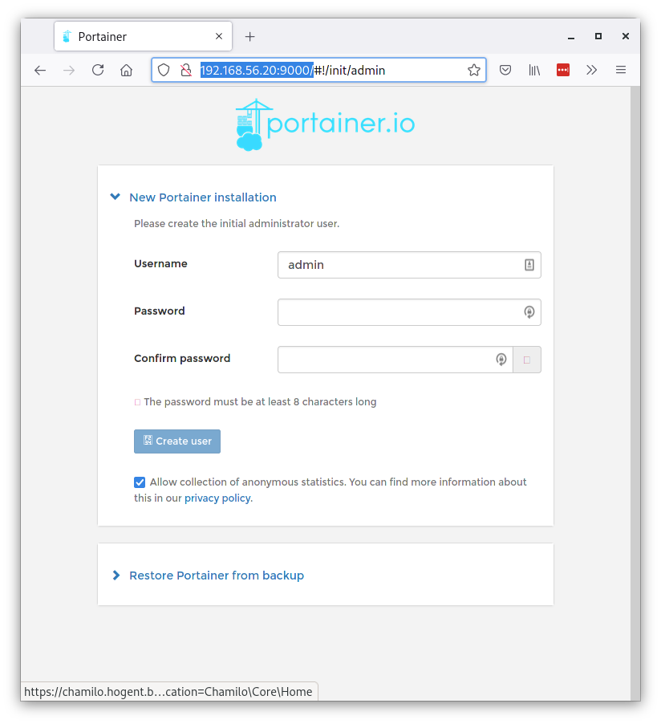
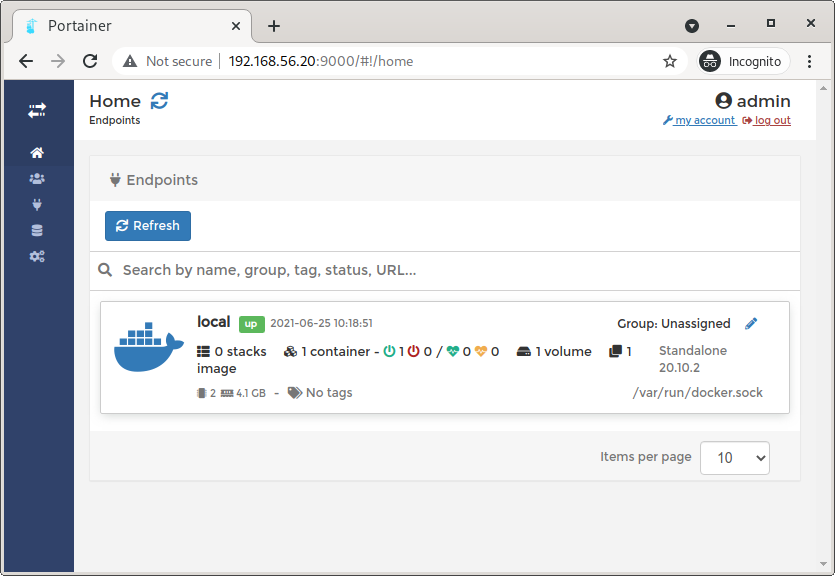

# Lab 1: Container virtualization

TODO: add intro

Add the most common commands that you need to manage Docker in your [cheat sheet](../report/cheat-sheet.md)!

## Learning goals

TODO

## 1.1 Set up the lab environment

Go to the `dockerlab` directory and start the Vagrant environment:

```console
$ cd dockerlab
$ vagrant status
Current machine states:

dockerlab                 not created (virtualbox)

The environment has not yet been created. Run `vagrant up` to
create the environment. If a machine is not created, only the
default provider will be shown. So if a provider is not listed,
then the machine is not created for that environment.
$ vagrant up
Bringing machine 'dockerlab' up with 'virtualbox' provider...

[...]

PLAY RECAP *********************************************************************
dockerlab                  : ok=23   changed=9    unreachable=0    failed=0    skipped=19   rescued=0    ignored=0   
```

The lab environment is set up using Ansible. We're going into that specific subject in the Configuration Management lab assignment.

### Portainer

We already pre-installed and spun up a container with [Portainer](https://www.portainer.io/), a web-ui for managing containers. Strictly speaking, Portainer is not necessary for completing the lab assignment, but it can help novice Docker users to explore the environment: container state, images, networks, etc. If the `vagrant up` command finished successfully, you can access the web UI by opening a web browser and entering URL <http://192.168.56.20:9000/>. The `dockerlab` VM can be reached from the physical system with IP address 192.168.56.20 (check this by pinging the VM!). Portainer, by default, listens on port 9000.

The fist time you access the Portainer web UI, you will be asked to create an admin user and password:



Choose a password **and be sure to write it down somewhere**, e.g. in your lab report.

In the next step, select the button with "Docker - Manage the local Docker environment" (on the left). You will see a warning that the Portainer container must be run with specific options, but don't worry, that's been taken care of. You can click the "Connect" button at the bottom.


The next page shows available endpoints. There is only one, the local Docker instance. Click on it to enter.



From there you access the Portainer dashboard. Explore the menu on the left and the tiles on the main part of the page to access overviews of containers, images, volumes, etc.

### Managing Docker from the CLI

We explored what's running on the Docker instance through Portainer, but it's important that you can manage Docker from the command line as well. The next part of this lab assignment explores the Docker command line interface. Don't hesitate to use the Portainer UI alongside to see what's happening.

In this VM, based on Ubuntu 20.04 LTS, Docker was already preinstalled and started. If you would want to install Docker on a system manually, check out the [Docker documentation](https://docs.docker.com/engine/install/). Remark that on a standard installation, you need to be root in order to execute Docker commands that change the state of the system. However, in this VM, the default user `vagrant` has been made a member of user group `docker`. As a consequence, it is not necessary to put `sudo` in front of docker commands.

First of all, log in to the VM. Open a terminal on your physical system (e.g. Bash on Linux, zsh on MacOS or Git Bash on Windows) and go to the `dockerlab` directory.

```console
$ vagrant ssh dockerlab
Welcome to Ubuntu 20.04.2 LTS (GNU/Linux 5.4.0-73-generic x86_64)

 * Documentation:  https://help.ubuntu.com
 * Management:     https://landscape.canonical.com
 * Support:        https://ubuntu.com/advantage

  System information as of Fri 25 Jun 2021 10:34:39 AM UTC

  System load:                      0.0
  Usage of /:                       4.0% of 61.31GB
  Memory usage:                     7%
  Swap usage:                       0%
  Processes:                        118
  Users logged in:                  0
  IPv4 address for br-6c56e6ec2cf2: 172.30.0.1
  IPv4 address for docker0:         172.17.0.1
  IPv4 address for eth0:            10.0.2.15
  IPv4 address for eth1:            192.168.56.20


This system is built by the Bento project by Chef Software
More information can be found at https://github.com/chef/bento
Last login: Fri Jun 25 08:33:47 2021 from 10.0.2.2
vagrant@dockerlab:~$ 
```

Try out the following commands to check if your Docker instance is running correctly and record the results in your lab report.

- Check the status of the Docker engine: `systemctl status docker`
- Check network TCP server ports that are in use on the system: `sudo ss -tlnp`
- List running Docker containers with `docker ps`
- List Docker images with `docker images`

## 1.2 Our first containers

### Hello world!

Run the command `docker run hello-world` and record the result. This is what will happen:

- The Docker engine notices that it doesn't have an image that matches the name `hello-world` and it will look for one online on the [Docker Hub](https://hub.docker.com). It will find and download the image. Next, it will create a new container based on this image and start it.
- This particular container doesn't do anything useful, but it will print a message ("Hello from Docker!") and exit.

Run `docker ps` and `docker ps -a` and notice the difference in the output.

The `hello-world` container image isn't all that useful, so you can remove it with `docker rmi hello-world`. Docker will complain that a container is still using the image. Remove that container with `docker rm ID` (with ID the container ID listed in the first column of `docker ps`, or the name mentioned in the last column.)

### Interactive and detached containers

Most Linux distributions offer Docker images with a minimal installation that you can use as a platform to run (web) applications. As an example, we'll launch an [Alpine Linux](https://alpinelinux.org/) instance and log into a shell inside the container. Alpine Linux is an extremely small Linux distribution, which is convenient in the context of Docker. The smaller your container, the less resources it uses.

Launch an Alpine container **interactively** (`-i`) and open a shell (`-t`):

```console
docker run -i -t --name alpine alpine
```

You will drop into a root shell inside the container. You can explore the contents. Which commands are available? Compare with the number of commands on the Ubuntu VM.

Open another terminal on your host system and log into the `dockerlab` VM. Execute the following commands and peruse the output. What do these commands do, exactly?

```console
docker container ls
docker inspect alpine
docker top alpine
```

Exit the shell in the Alpine container and repeat the previous commands. Is the container still running?

Next, we will launch the container in the background (*detached*):

```console
docker run -i -t -d --name alpine alpine
```

Docker complains that a container with that name already exists. Remove it with `docker rm alpine`. Repeat the `docker run` command and record the output, a hash identifying the container (the container ID).

Since the container runs in detached mode, and doesn't have any running services, it isn't directly reachable. Try the following commands to execute a command inside the Alpine container and record the results:

```console
docker exec -t alpine /bin/hostname
docker exec -t alpine /sbin/ip a
docker exec -i -t alpine /bin/sh
```

- Compare the host name with the container ID
- What's the IP address of the container? Try to ping it from inside the `dockerlab` VM.
- After you exit the shell, is the container still running? Check with `docker ps` and `docker ps -a`
- Stop and remove the container when you're ready, we won't need it anymore.

### Running a web application

Run the following commands to download a Docker image and launch a container, and record the results. List the available Docker images and running containers afterwards. What's the container ID? What's the IP address of the container?

```console
docker pull tutum/hello-world
docker run -d -p 80 --name helloapp tutum/hello-world
```

The `docker run` command started a container named `helloapp` and exposed port 80. That basically means that the container runs a website and listens on port 80. Check that this is in fact the case using `curl http://IP_ADDRESS/` (with IP_ADDRESS the IP address of the `helloapp` container) and record the result.

Services that run inside containers can be made available to the outside world through port forwarding. Network traffic that arrives on the host system on that port, will be forwarded to port 80 of the container. Consequently, multiple containers may have port 80 exposed, but this will not result in a conflict on the host system, since they will be forwarded through a different port number.

What's the forwarded port for the `helloapp` container? There's several ways to determine this, a.o. `docker ps` and `docker port ID` (with ID the container ID of the `helloapp` container). Check if this works with `curl http://localhost:PORT/` (with PORT the forwarded port) and by opening a browser window on your physical system and go to URL <http://192.168.56.20:PORT>. Record the results, and take a screenshot of the web page. You should get something like this:

.

## 1.3 Persistent data

## 1.4 Custom images

## 1.5 Layered file system

## 1.6 Volumes and networks

## 1.7 Docker compose